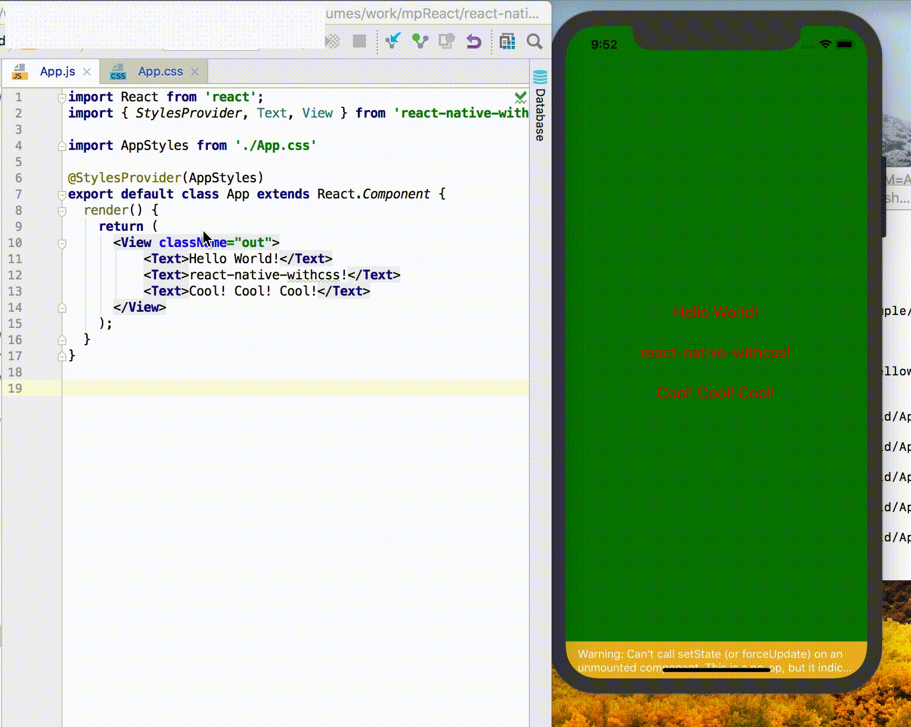

[](https://www.npmjs.com/package/react-native-withcss)
[](https://www.npmjs.com/package/react-native-withcss)


# react-native-withcss

[English doc](./README.md)

[react-native]() + css, cool!



## Features
* 支持css文件
* 支持css文件的HMR
* css文件支持@import
* 支持css部分选择器： 类选择器，标签选择器，后代选择器。 
* 支持属性继承
* 支持属性简写

需要提醒的是 react-native-withcss并没有实现css的任何属性 如果RN对css的某个属性没有支持，比如(display: block), 那么react-native-withcss也不会支持

## Installation
#### 1. 安装`babel-plugin-import-css`
由于React Native无法加载css, 先要使用一个babel plugin
```
npm install babel-plugin-import-css --save-dev
```
添加这个到 `.babelrc` 文件
```
{
  "plugins": ["babel-plugin-import-css"],
  ...
}
```

#### 2. 安装`react-native-withcss`
```
npm install react-native-withcss --save
```

#### 3. 添加命令cssWatch
在package.json的 scripts里添加命令 cssWatch（为了Live Reload / Hot Reload）
```
"scripts": {
    "start": "react-native-scripts start",
    "eject": "react-native-scripts eject",
    "android": "react-native-scripts android",
    "ios": "react-native-scripts ios",
    "test": "jest",
    "cssWatch": "cssWatch"  
  },
```

## Getting started
以一个简单的HelloWorld为例：

App.js
```javascript
import React from 'react'
import { StylesProvider, Text, View } from 'react-native-withcss'

import AppStyles from './App.css'

@StylesProvider(AppStyles)
export default class App extends React.Component {
  render() {
    return (
      <View>
        <Text>Hello World</Text>
      </View>
    );
  }
}
```

App.css
```css
View {
    border-width: 1px;
    height: 100%;
    align-items: center;
    justify-content: center;
}

Text {
    color: black;
    font-size: 15px;
    line-height: 50px;
}
```
需要注意的是 现在使用RN的组件需要`import { Text, View } from 'react-native-withcss'`

## Live Reload / Hot Reload
React Native 自己提供了Live Reload / Hot Reload的功能。 如果想让.css文件具备Live Reload / Hot Reload，请务必在执行
```
npm run cssWatch
```

## Example
[Hello World](./example/helloworld)

[Hello World Native](./example/helloworldnative)

[with-navigation](./example/withnavigation)

[TodoList](./example/TodoList)

TodoList 是一个包含了所有特性的事例， 如果你有任何问题， 都可以参考TodoList的代码

## API
#### StylesProvider
使用方式
```
import homeCss from './home.css'
@StylesProvider(homeCss)
class Home extends React.Component {
}

/// 或者
StylesProvider(homeCss)(Home)
```
StylesProvider 给组件提供一个样式文件， 其子组件都将根据这个样式文件去计算自己的样式。 推荐在每一个页面的容器组件上使用StylesProvider，一个页面一个样式文件。 
实际上，可以在任何组件上使用StylesProvider。 
推荐使用注解的方式，但是如果是Functional Components， 那么只能用`StylesProvider(homeCss)(Home)` 这种方式了。 

#### ClassEnable
使用方式
```javascript
@ClassEnable
class XXX extends React.Component {
    static displayName = "XXX"
    ...
}

/// 或者
ClassEnable(XXX)
```
每一个ClassEnable的组件都会根据祖先元素指点的css文件去计算自身的样式，计算好的样式会赋值到 `this.props.style` 这个属性。 

比如：
```javascript 
@ClassEnable
class XXX extends React.Component {
    static displayName = "XXX"
    render() {
        return (
            <View style={this.props.rncStyle}>
                <Text>this is XXX</Text>
            </View>
        ) 
    }
}

@StylesProvider(appCss)
class App extends React.Component {
    render() {
        return (
            <View>
                <XXX className="xx"/>
            </View>
        )
    }
}

```
样式文件
```css
.xx {
    border-width: 2px
}
```

同时 react-native-withcss也是支持标签选择器的。 所以上面的css文件也可以写成下面这样的：
```css
XXX {
    border-width: 2px
}
```
**注意** 由于在打包之后js代码会被压缩，所以当你的组件需要使用 标签选择器的时候， 请务必给组件加上 displayName

另外， react-native-withcss 提供了一套与React Native官方对应的基本组件，默认开启ClassEnable， 所以在使用基本组件的时候推荐：
```javascript
import {View, Text ...} from 'react-native-withcss'
```
或者当都需要使用的时候
```javascript
import {View, Text} from 'react-native'
import {View as CSSView , Text as CSSText...} from 'react-native-withcss'
```

## 属性简写
比如
```css
View {
    margin: 20px
    padding: 20px    
}
```

## 属性继承
对于文本类型的属性fontSize, color等，可以在最外层组件声明， 类似于web。 
```css
.clz {
    font-size: 12px;
    color: red;
}
```
```javascript
class A extends Component {
    render() {
        return (
            <View className="clz">
                <Text>H</Text>
                <Text>E</Text>
                <Text>L</Text>
                <Text>L</Text>
                <Text>O</Text>
            </View>
        )
    }
}
```

## 选择器支持
现阶段，我们只支持标签选择器， 类选择器， 后代选择器
### 标签选择器
对于基本组件，react-native-withcss 提供了一套与React Native官方对应的基本组件。 所以可以直接
```css
View {
    margin: 20
}
```
```javascript
class A extends Component {
    render() {
        return (
            <View/>
        )
    }
}
```
对于自定义组件， 正如之前所说 需要开启 `ClassEnable`， 另外不要忘记了指定displayName

标签选择器影响范围很大的， 比如View， 那么所有View的样式都将会受到影响， 所以还是慎用标签选择器吧

### 类选择器
类选择器是使用的最多的一类选择器了。 比如
```css
.label {
   font-size: 12px
   color: red
}
```
```javascript
@StylesProvider(css)
class A extends Component {
    render() {
        return (
            <View className="label"><Text>Hello World</Text></View>
        )
    }    
}
```

### 后代选择器
react-native-withcss 支持后代选择器， 比如我们有一个`按钮`， 在不同的情况下， 需要`按钮`背景色不同。 通常，我们可以通过父组件把背景色作为参数向下传递的方式。 而如果使用react-native-withcss， 那我们就可以
```javascript
@ClassEnable
class MyBtn extends Component {
    static displayName = "MyBtn"
    render() {
        ...
    }
}
```
然后在使用的时候
```css
.best MyBtn {
    background: #00ff00
}

.good MyBtn {
    background: #00aa00
}

.bad MyBtn {
    background: #aa0000
}

.worse MyBtn {
    background: #ff0000
}
```

```javascript
@StylesProvider(infoCss)
class Info extends Component {
    render() {
        return (
            <View>
                <View className="best">
                    <MyBtn/>
                </View>
                
                <View className="good">
                    <MyBtn/>
                </View>
                
                <View className="bad">
                    <MyBtn/>
                </View>
                
                <View className="worse">
                    <MyBtn/>
                </View>
            </View>
        )
    }
}

```

## @import
很多情况下， 我们会有一个公共的css文件， 这个文件里面包含了我们App的基本共用样式， 我们当然不会希望在每个css文件之前都重复的写一下这下样式， 这不仅麻烦， 修改起来也很不方便， 这个时候就可以用到 `@import`
我们可以把共用样式写在 一个公共的css文件里面， 然后通过@import 引用


